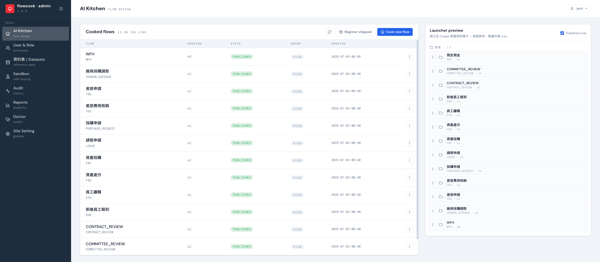

import YouTube from '../../../components/YouTube.astro'

AI Kitchen 是後台的流程設計中心。左側是已煮好的流程（Cooked flows）與狀態，右側 **Launcher preview** 直接預覽員工在前台 Create 頁看到的樣子——拖曳排序、換圖示，即改即見。

設計一條新流程：按 **Cook new flow** 給流程代碼與名稱，進入精靈，走三幕：

## 第一幕 · Prep（備料／設計）

左邊跟 AI 對談、右邊即時看生成結果，精靈依序走七步。每一步都有獨立的教學短片：

| 步驟 | 談什麼 | 教學影片 |
|---|---|---|
| **Source** | 流程的來源材料 — 可上傳現有 BPMN / 流程圖片，或用一句話描述，AI 直接畫出骨架 | ① 來源 |
| **Forms** | 表單欄位、型別、驗證、條件必填 | ② 表單 |
| **Access** | 誰能發起、誰能旁觀這條流程 | ③ 權限 |
| **Decisions** | 條件路由（金額門檻、天數規則⋯）與 default 路徑 | ④ 決策 |
| **Approvers** | 每一關誰簽（主管/部門主管/角色），含並簽設定 | ⑤ 審核者 |
| **Notify** | 每一關的通知對象與雙語信件內容 | ⑥ 通知 |
| **Integrations** | 資料集、外部 API 串接（純內部流程可空） | ⑦ 整合 |

每步有檢核，全部通過才能 **Submit to chef**（送交生成）。Prep 階段隨時可 **Download bundle** 拿 spec zip。

<YouTube id="2PWZcHhWrFY" title="Prep ① 來源：一句話生成流程" />
<YouTube id="awOgno2q11s" title="Prep ② 表單：用對話生出欄位" />
<YouTube id="ArYWyBKMM2w" title="Prep ③ 權限：誰能發起這個流程" />
<YouTube id="7A5WXhzMVms" title="Prep ④ 決策：分流條件怎麼設" />
<YouTube id="veVczJaX4S0" title="Prep ⑤ 審核者：每一關誰簽" />
<YouTube id="tu-rGEJPFKU" title="Prep ⑥ 通知：誰在什麼時候收到信" />
<YouTube id="85aaO6mGDgo" title="Prep ⑦ 整合：對外 API" />

## 第二幕 · Cook（烹調／生成）

AI 把 spec 煮成 per-flow 程式。Cook 分頁有進度對話串——主廚接單後會列出烹調計畫與工作日誌，生成過程有問題可以**開 issue** 退回處理，完成會附完整交付報告與產出物清單。

<YouTube id="MTaOc4mCAGE" title="Cook ① 送單與接單" />
<YouTube id="41_oOIbUong" title="Cook ② 交付報告" />

## 第三幕 · Serve（上菜／驗收部署）

驗收與上線的控制檯：**Approve**（規格核可）→ **Publish**（部署上線，可即時看進度、失敗可重試）。上線後員工的 Quick Actions 立即看得到；也可 **Unpublish** 下架。實際的驗收在 [Sandbox](/backend/sandbox/) 進行。

<YouTube id="oMlCGgaxQOw" title="Serve 上線：Approve → Publish → 前台看到" />

## 流程的生命週期

清單上的狀態徽章：`Draft → Submitted → Cooking → Committed → Approved → Published`（中途可 OnHold / Rejected；上線後可 **Retired** 退役）。常用管理動作在每列的選單裡：**Rename**（改顯示名）、**Clone as new version**（複製成 v+1 草稿——改規則走這條）、**Retire / Unretire**、指派 launcher 分組。
