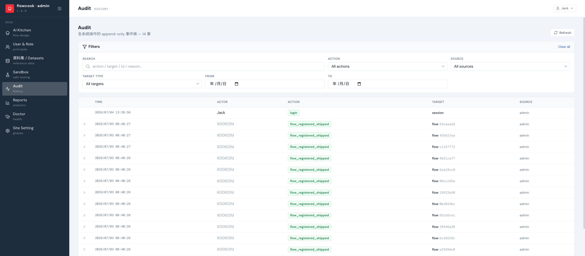

Audit 記錄全系統的管理操作：誰、什麼時候、對什麼做了什麼。**append-only**——只能追加，不能改不能刪。

## 會記什麼

- 登入（login）
- 流程註冊/上線（flow_registered_shipped）、發布狀態變更
- 組織與設定的管理異動

每筆含 **TIME / ACTOR / ACTION / TARGET / SOURCE**，可依動作類型、來源、對象類型與日期區間篩選，關鍵字搜 action / target / id / reason。點開單筆可看**變更前後的完整差異**（before/after）與操作原因。

:::note
案件層級的簽核紀錄在各案件的 Approval Timeline；Audit 管的是**系統與管理面**的操作。
:::
