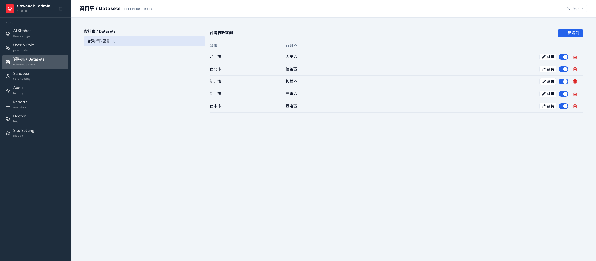

資料集是**參考資料表**：行政區、幣別、供應商清單……表單裡的下拉選單、連動選擇從這裡取值，改資料不用改流程。

## 特性

- 每個資料集是一張獨立資料表；**欄位結構在導入時定義**（隨流程一起設計），後台頁面編輯的是**資料列**
- 資料列可新增、直接改格、啟用/停用（下架選項不用刪資料）、刪除；前台表單即時取用
- 也開放 [OData 動態表端點](/api/datasets/)（`/odata-ds`），客戶的 iPaaS 可自動推送更新——供應商清單交給採購系統維護，flowcook 只讀
