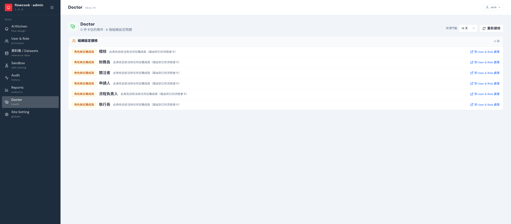

Doctor 是系統健檢：主動找出**停滯案件**與**組織設定問題**，在使用者回報之前先看到。

## 檢查什麼

| 類別 | 例子 | 能直接做什麼 |
|---|---|---|
| **離職者的未結案件** | 簽核者已離職、案件懸在他手上 | **批次改派**（系統建議接手人，可搜尋改指定） |
| **停滯案件** | 超過門檻天數（7/14/30 天可調）沒動、或無人可處理 | 逐案**改派**或**強制取消**（都有確認） |
| **組織設定** | 角色/群組沒有在職成員（路由到它的流程會卡）、部門缺主管 | 直達連結跳 [User & Role](/backend/user-role/) 補人 |

導入時跑一次 Doctor，等於幫[上線 checklist](/onboarding/golive-checklist/) 做體檢；上線後定期看，問題在被回報之前就先修好。
