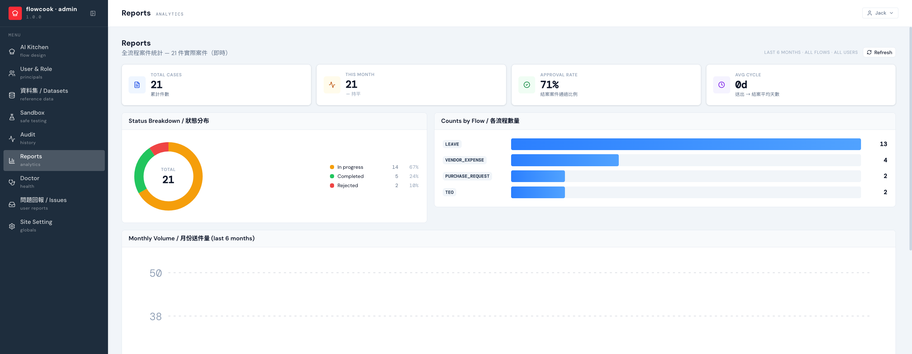

Reports 是全流程的即時統計：多少件、卡在哪、過件率如何、簽一件平均要幾天——上線後檢視流程健康度的第一站。

## 看什麼

| 區塊 | 內容 |
|---|---|
| **Total cases / This month** | 累計與當月送件量（含與上月比較） |
| **Approval rate** | 已結案案件的通過比例——過低可能代表表單設計讓人填錯，過高可能代表簽核形同虛設 |
| **Avg cycle** | 送出 → 結案的平均天數——簽核效率的直接指標 |
| **Status Breakdown** | 進行中 / 已完成 / 已退件的即時分布 |
| **Counts by Flow** | 各流程的件數排行——哪些流程最常被使用 |
| **Monthly Volume** | 近 6 個月送件趨勢 |

## 使用建議

- 數字是**即時**計算的，按 **Refresh** 就是當下狀態
- 想知道「哪幾件卡住、卡在誰」，用 [Doctor](/backend/doctor/) ——Reports 看整體，Doctor 點名個案
- 需要進一步在 Excel / Power BI 做交叉分析，可用 [OData 整合](/api/overview/)把資料拉出去
