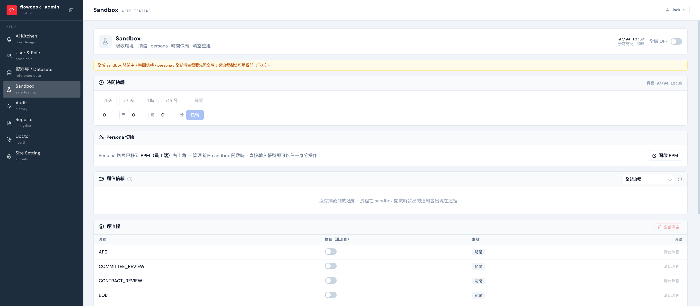

Sandbox 讓驗收「不用真的來」：不真的寄信、不真的等七天假期過完、不用叫十個同事各登一次入。

## 四件武器

| 功能 | 做什麼 |
|---|---|
| **攔信信箱** | 流程發出的通知信全部攔下來集中看，不寄到真信箱；可全域開，也可逐流程開 |
| **Persona 切換** | 在前台右上角頭像選單直接切身分：sandbox 開啟時管理員**輸入任意帳號 email 即可切換**、一鍵返回真實身分——一個人演完申請人→主管→HR 全條鏈 |
| **時間快轉** | 沙箱時鐘 +1 天 / +7 天 / 自訂，逾時提醒、跨日規則不用真等 |
| **狀態重置** | 清空測試案件重跑，驗收可以反覆來 |

:::note[全域開關]
時間快轉 / persona / 全部清空需要先開 **全域 sandbox**；逐流程攔信可單獨開。上線後全域關閉，一切回到真實行為。
:::

導入時的驗收怎麼跑，見 [Sandbox UAT](/onboarding/sandbox-uat/)。
