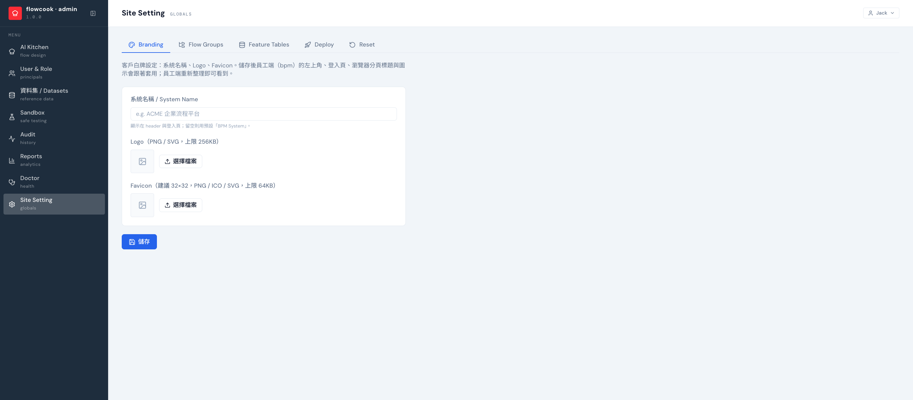

Site Setting 是站台層級的全域設定，五個分頁：

| 分頁 | 做什麼 |
|---|---|
| **Branding** | 白牌設定：系統名稱、Logo、Favicon。儲存後員工端 header、登入頁、瀏覽器分頁全部換裝 |
| **Flow Groups** | 流程分組 — 員工端 Quick Actions / Create 目錄的分類（中英名稱、圖示、排序）；刪除分組時流程會落回「其他」 |
| **Feature Tables** | 流程資料表的對帳與封存：看每張表是 Linked / Orphan / Archived，退役流程的表可**封存**釋出命名空間、也可**還原**（打字確認，動作謹慎） |
| **Deploy** | 發布部署的目標環境設定（Azure 資源名稱，僅名稱不含密鑰）— Publish 上線用 |
| **Reset** | **整站重置** demo 環境：清運行資料 → 重種組織 → 重上架全部流程。要打字 `RESET` 確認，完成會自動登出。**正式站不要碰** |

改完 Branding，員工端重新整理即生效——系統立刻換上貴公司的名稱與 Logo。
