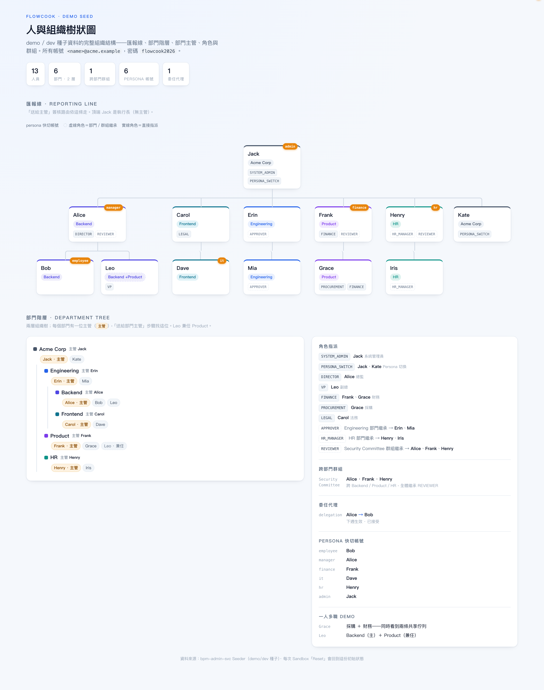

內建 demo 組織 **Acme Corp**：13 個使用者、6 個部門、1 個群組（Security Committee）、14 個角色。導入對談與 Sandbox 驗收都拿這套當舞台。

上圖是整套 demo 組織的全貌（點擊可放大）：上半是**匯報線**（Jack 執行長在頂，往下到各部門主管再到組員，「送給主管」簽核就依這條走），下半左邊是**部門階層**（兩層樹、每部門標主管），右邊是**角色指派、跨部門群組、委任與 persona 帳號**。以下逐項說明。

## 常用人物

| 人物 | 身分 | 在 demo 裡演什麼 |
|---|---|---|
| **Bob** | 一般員工（Backend） | 申請人 — 送請假、報帳、採購 |
| **Alice** | 主管 | 第一關簽核、Bob 的 manager |
| **Frank** | 財務（FINANCE） | 金額類流程的財務關 |
| **Henry** | 人資（HR_MANAGER） | 假勤/人事流程的 HR 關 |
| **Dave** | IT | 設備/帳號類流程 |
| **Grace** | 採購（PROCUREMENT） | 採購類流程 |
| **Jack** | 系統管理員（SYSTEM_ADMIN） | 後台登入、AI Kitchen 操作 |

登入：`<name>@acme.example` / `flowcook2026`（dev 模式另有 persona 快速切換）。

## 角色解析的三條路

流程指派簽核者時走三種解析，demo 組織三種都演得出來：

1. **直屬主管**（manager）— Bob 的單送 Alice
2. **部門主管**（dept head）— 按申請人部門找主管
3. **角色**（role code）— `HR_MANAGER` → Henry、`FINANCE` → Frank

:::note
demo 資料是 seed 出來的，重置後指派可能變動；以 [User & Role](/backend/user-role/) 當下顯示為準。
:::
