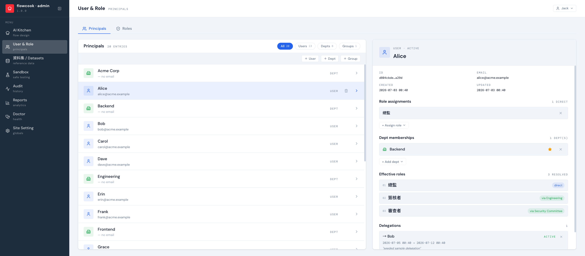

:::note
以下拿我們 demo 組織當範例。你們公司的部門/角色名稱會不一樣，但**設定與操作方式相同**。
:::

## 通用角色概念

| 通用角色 | 在流程裡做什麼 |
|---|---|
| 申請人 | 送出申請、追蹤自己的案件 |
| 審核者 | 在收件匣簽核/退回；可設委任代理人 |
| 管理員 | 維護組織（User & Role）、跑 AI Kitchen、Sandbox |

## 怎麼設定角色

在後台 **User & Role**：左欄是全部 principal（使用者 / 部門 / 群組，可依類型篩選），點一筆右欄編輯基本資料、部門歸屬與角色指派。角色可掛在部門或群組上，成員自動繼承。

流程裡的簽核對象（主管、部門主管、特定角色）就是從這裡的組織資料解析出來的——組織資料對了，路由就對了。
