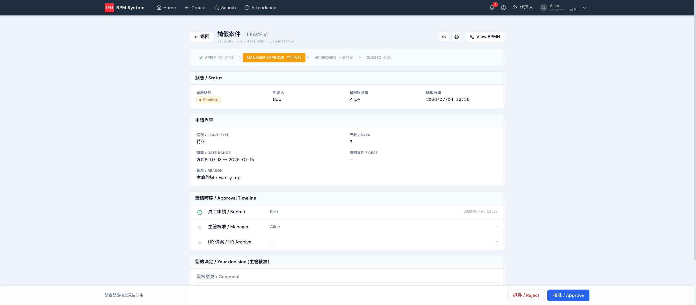

import YouTube from '../../../components/YouTube.astro'

簽核是主管/審核者在收件匣對案件核准或退回。從首頁 **Pending My Action** 點 Open 進入案件，畫面上半是申請內容與簽核時序，底部固定的動作列做決定。

## 畫面重點

- **關卡進度條**（頂部）：APPLY → MANAGER APPROVE → HR RECORD → CLOSED，一眼看出案件走到哪
- **簽核時序 / Approval Timeline**：每一關誰簽的、何時簽的
- **您的決定**：填簽核意見（退件時建議必填），按 **核准 / Approve** 或 **退件 / Reject**——都會跳確認視窗，不會誤觸

## 並簽（多人同關）

並簽時多位審核者同時待簽，案件頁會出現**並簽面板**：政策標籤（「並簽 · 需全部核准」或「門檻 M/N」）、進度條，以及逐位審核者的狀態（待簽核 / 已核准 / 已退件 / 略過）。每位審核者對自己的格子做決定，互不代簽。

- **全簽（AND）**：每位都要核准；任何一人退件 → 整關退回
- **門檻（M/N）**：達門檻票數即通過，其餘待簽自動**略過**
- 示範流程：`CONTRACT_REVIEW`（全簽）、`COMMITTEE_REVIEW`（2/3 門檻）
- **View BPMN** 流程圖會把並行分支同時標成進行中，一眼看懂案件同時在等誰

<YouTube id="BA5XHsZvIGA" title="簽核與並簽解說" />
