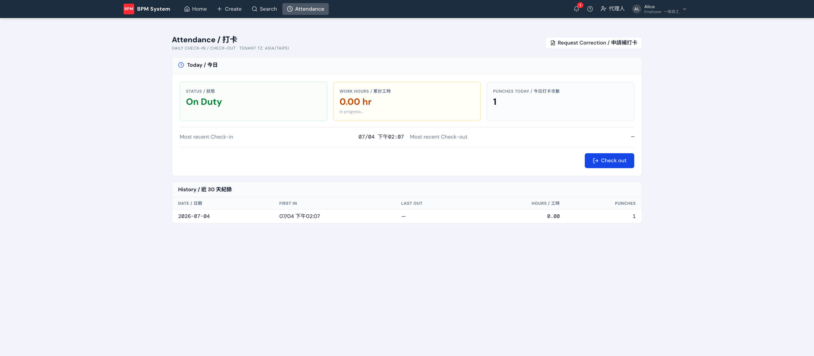

上方導覽列 **Attendance** 是每日打卡頁：一鍵 Check in / Check out，即時顯示今日狀態、累計工時與近 30 天紀錄。

## 重點

- **時區跟租戶**：以站台時區計算（如 Asia/Taipei），跨時區出差不會亂
- **一天可多次**：外出/回來可以多段打卡，工時累計

## 補打卡（Request Correction）

忘了打卡時，右上角 **Request Correction / 申請補打卡**：

1. 填**日期、卡別（上班/下班）、時間、事由**送出（可補 30 天內的卡；同一天同卡別一次只能有一筆待審申請）
2. 你的**直屬主管**會收到通知，申請出現在主管的[簽核匣](/frontend/inbox/)，核准或駁回都可以帶備註
3. **核准後打卡紀錄自動補上**（來源標記為補卡），駁回會通知原因
4. 頁面下方的「我的補卡申請」隨時可查每筆申請的狀態與審核結果
