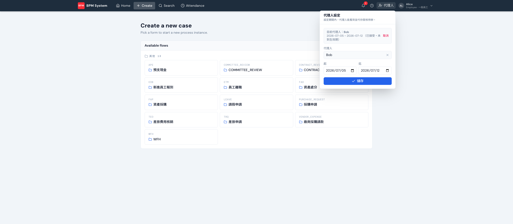

主管休假時流程不能停。**代理人**功能讓你在設定期間內，把「看到並代簽你的待辦」的權限交給指定同事。

## 怎麼設

上方導覽列 **代理人** → 選人、設起迄日期 → 儲存。

- 對方會收到**委任邀請**，接受後才生效（狀態會顯示「已接受・未到生效期」等）
- 生效期間內，代理人的收件匣會看到你的待辦，代簽紀錄會標明是代理簽核
- 期間結束自動失效，不用手動取消

:::note
代理人跟 dev 模式的 persona 切換是兩回事：委任是**正式功能**（有邀請、有期限、有稽核），persona 切換只是開發/驗收用的快速登入。
:::
