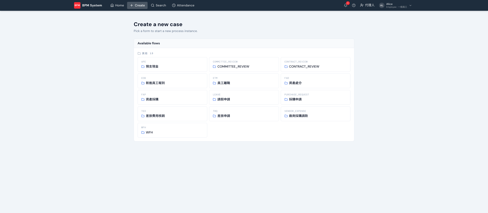
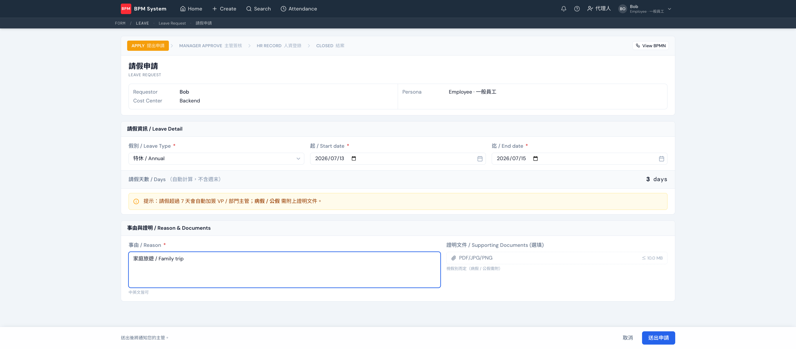

開新申請有兩條路：首頁 **Quick Actions** 直接點，或上方 **Create** 進完整表單目錄。目錄只列「已上線（Published）」的流程，分組與排序由後台 AI Kitchen 的 launcher 設定控制。

## 表單長什麼樣

每張表單都是為該流程量身生成的，共同元素：

- **關卡進度條**（頂部）：這條流程會經過哪些關卡，還沒送出就先看見全貌；**View BPMN** 可看流程圖
- **申請人資訊卡**：帶入登入者與所屬部門，不用自己填
- **中英雙語欄位**與即時驗證：必填、格式、條件必填（例如病假 → 證明文件變必填）
- **衍生欄位**：如請假天數自動計算（不含週末），規則在 AI Kitchen 設計時談定

## 送出

底部動作列按 **送出申請** → 跳確認視窗（摘要這張單要送去哪）→ 確認後案件成立，指派給第一關處理人並發通知。之後在首頁 **My Recent Cases** 追蹤。
