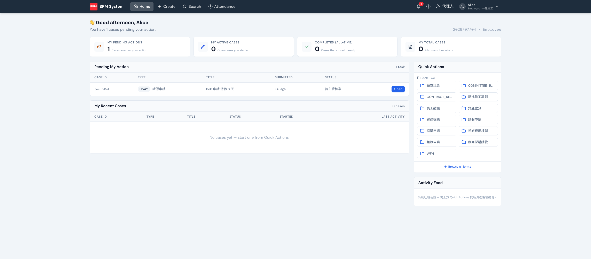

flowcook 的收件匣是 **unified inbox**：不管哪一隻流程、哪一種關卡，等你動作的案件都彙整在首頁 **Pending My Action**，點 **Open** 進案件詳情。

## 案件詳情怎麼讀

由上而下四段：

| 區塊 | 內容 |
|---|---|
| **關卡進度條** | 目前走到哪一關（橘色 = 現在卡的關） |
| **狀態 / Status** | 目前狀態、申請人、**目前指派給**誰、送出時間 |
| **申請內容** | 這張單填了什麼 |
| **簽核時序 / Approval Timeline** | 每一關誰處理、何時處理 |

若你就是目前處理人，底部會出現動作列（核准/退件等，見[簽核](/frontend/approval/)）；若不是，會提示目前由誰處理。申請人本人另有**撤回申請**。

## 小工具

- 案件頁右上角可**複製本案連結**（貼給同事直接開）與**列印此案件**
- **View BPMN** 開流程圖：已走過的節點、目前所在（並簽會同時亮多個）、退回與略過都有顏色標記，可縮放
- 附件欄位點擊即可安全下載

## 流程改版了，舊案怎麼辦

流程用版本演進（v1 → v2⋯⋯）。舊案件**照原版本走完**，案件頁若該版本已下架或有新版，會出現橫幅提示——員工不用做任何事。
