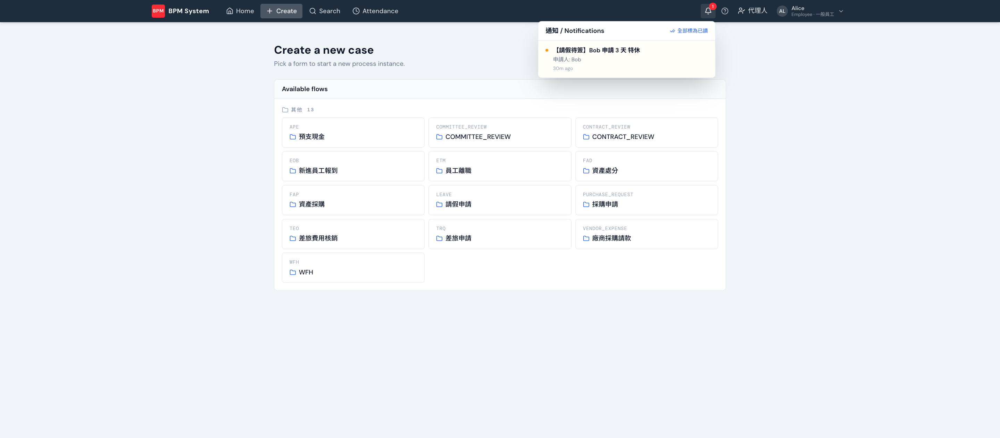

案件每前進一關，相關人就會收到通知：**站內鈴鐺** + **email** 雙管道。

## 誰收到什麼

| 事件 | 通知對象 |
|---|---|
| 案件送出 | 下一關處理人（「待簽」通知） |
| 核准 / 退件 | 申請人（案件前進或退回） |
| 委任邀請 | 被指定的代理人 |
| 結案 | 申請人 |

通知模板是 per-flow 的，在 AI Kitchen 設計時一起談（標題、內容、收件人）。

## 鈴鐺的行為

- 未讀數字即時顯示（上限顯示 9+），每 30 秒自動更新
- 點通知 → 標為已讀並**直接跳進該案件**；右上角可**全部標為已讀**

## 驗收時不想寄真信？

Sandbox 開啟時，email 全部進[攔信信箱](/backend/sandbox/)集中看，不會寄到真信箱——這是導入 UAT 的標配。
