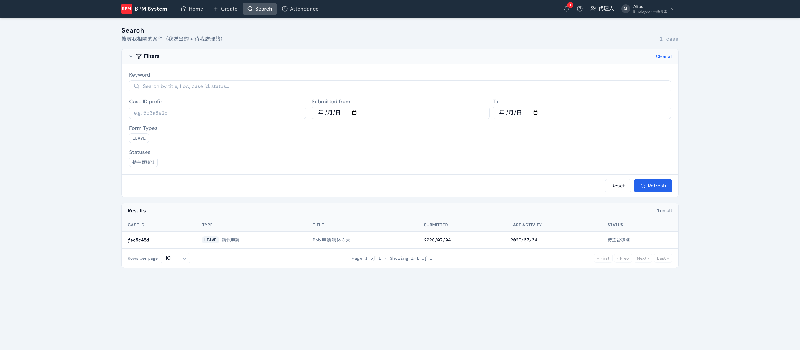

上方導覽列 **Search** 搜尋「跟我有關」的案件（我送出的 + 待我處理的）。

## 篩選條件

- **Keyword**：標題、流程名、case id、狀態全文比對
- **Case ID prefix**：拿到別人貼的案號前幾碼就能找
- **Submitted from / To**：送件日期區間
- **Form Types / Statuses**：多選流程與狀態 chip，點擊切換

結果支援分頁（10/25/50 筆），點列進案件詳情。

:::tip[鍵盤快搜]
任何頁面按 **⌘K**（Windows：Ctrl+K）叫出快速搜尋，即打即出前 8 筆，Esc 關閉。
:::
